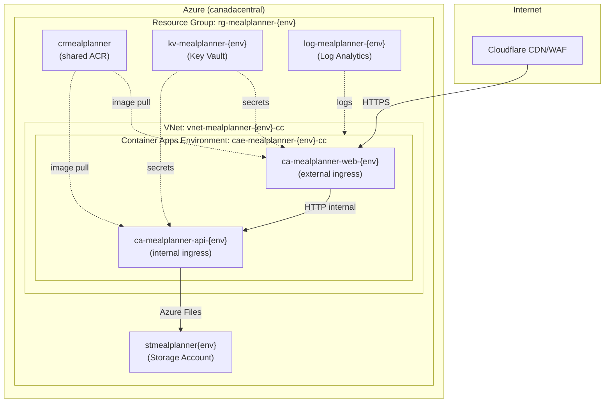

# MealPlanner — Azure Infrastructure

Infrastructure-as-Code (Bicep) for deploying MealPlanner to Azure Container Apps.

## Architecture



## Prerequisites

- [Azure CLI](https://learn.microsoft.com/en-us/cli/azure/install-azure-cli) (v2.60+)
- An Azure subscription
- Bicep CLI (bundled with Azure CLI)
- Docker images pushed to ACR (see [release workflow](../.github/workflows/release.yml))

## Environments

| Environment | Resource Group | Purpose |
|-------------|---------------|---------|
| `uat` | `rg-mealplanner-uat` | User acceptance testing |
| `prd` | `rg-mealplanner-prd` | Production |

## Deployment

### 1. Create the resource group

```bash
# UAT
az group create --name rg-mealplanner-uat --location canadacentral

# PRD
az group create --name rg-mealplanner-prd --location canadacentral
```

### 2. Deploy infrastructure

```bash
# UAT
az deployment group create \
  --resource-group rg-mealplanner-uat \
  --template-file infra/main.bicep \
  --parameters @infra/environments/uat.bicepparam \
  --parameters jwtSigningKey='<your-jwt-key>' \
               googleClientId='<your-google-client-id>' \
               googleClientSecret='<your-google-client-secret>' \
               apiImageTag='1.0.0' \
               webImageTag='1.0.0'

# PRD
az deployment group create \
  --resource-group rg-mealplanner-prd \
  --template-file infra/main.bicep \
  --parameters @infra/environments/prd.bicepparam \
  --parameters jwtSigningKey='<your-jwt-key>' \
               googleClientId='<your-google-client-id>' \
               googleClientSecret='<your-google-client-secret>' \
               apiImageTag='1.0.0' \
               webImageTag='1.0.0'
```

### 3. Push images to ACR

```bash
az acr login --name crmealplanner

docker tag mealplanner-api:1.0.0 crmealplanner.azurecr.io/mealplanner-api:1.0.0
docker tag mealplanner-web:1.0.0 crmealplanner.azurecr.io/mealplanner-web:1.0.0

docker push crmealplanner.azurecr.io/mealplanner-api:1.0.0
docker push crmealplanner.azurecr.io/mealplanner-web:1.0.0
```

### 4. Configure Cloudflare DNS

After deployment, the output `webFqdn` provides the external FQDN of the web container app.
Point your Cloudflare DNS CNAME record for `mealplanner.cameronmckay.ca` to this FQDN.

## Naming Convention

All resources follow the [Azure Cloud Adoption Framework naming convention](https://learn.microsoft.com/en-us/azure/cloud-adoption-framework/ready/azure-best-practices/resource-naming):

**Pattern**: `{abbreviation}-{workload}-{component?}-{environment}[-{region}]`

| Resource | Example (PRD) |
|----------|---------------|
| Resource group | `rg-mealplanner-prd` |
| Virtual network | `vnet-mealplanner-prd-cc` |
| Subnet | `snet-mealplanner-prd-cc` |
| Container Apps Environment | `cae-mealplanner-prd-cc` |
| Container App (API) | `ca-mealplanner-api-prd` |
| Container App (Web) | `ca-mealplanner-web-prd` |
| Container Registry | `crmealplanner` (shared) |
| Storage Account | `stmealplannerprd` |
| Key Vault | `kv-mealplanner-prd` |
| Log Analytics | `log-mealplanner-prd` |

## Tagging Strategy

All resources are tagged with:

| Tag | Description |
|-----|-------------|
| `app` | `mealplanner` |
| `environment` | `uat` or `prd` |
| `region` | `canadacentral` |
| `managedBy` | `bicep` |
| `repo` | `cam96/MealPlanner` |
| `createdBy` | Person/tool deploying |
| `createdDate` | `YYYY-MM-DD` |
| `purpose` | Per-resource description |

## Updating Deployments

To deploy a new version:

```bash
az deployment group create \
  --resource-group rg-mealplanner-uat \
  --template-file infra/main.bicep \
  --parameters @infra/environments/uat.bicepparam \
  --parameters apiImageTag='1.1.0' webImageTag='1.1.0' \
               jwtSigningKey='<key>' googleClientId='<id>' googleClientSecret='<secret>'
```

## Security Notes

- **Cloudflare IP restrictions**: The web container app only accepts traffic from Cloudflare IPv4
  ranges. All other traffic is denied. Update the IP list in `container-app-web.bicep` if
  Cloudflare publishes new ranges.
- **Managed Identity**: Container Apps use system-assigned managed identity for ACR pull
  (no stored credentials).
- **Key Vault**: Secrets are stored in Key Vault with RBAC access (Key Vault Secrets User role).
- **Internal API**: The API container app has internal-only ingress — it's not reachable from
  the internet.
