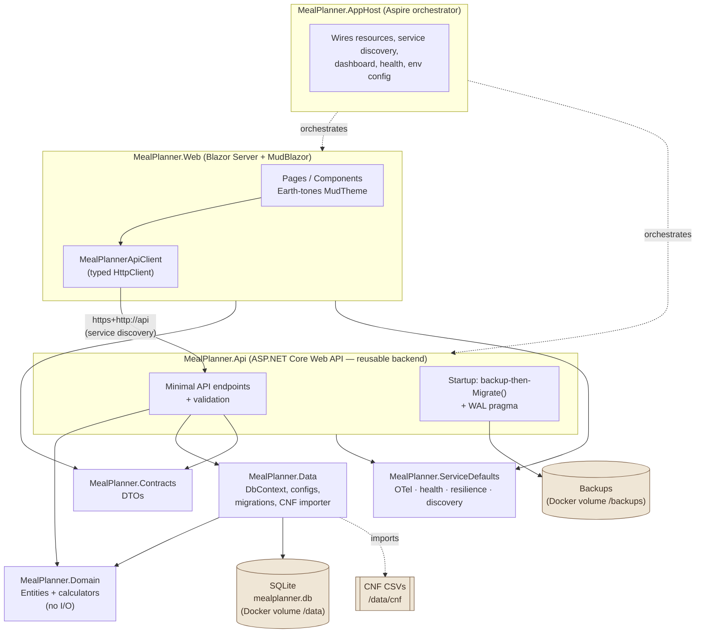
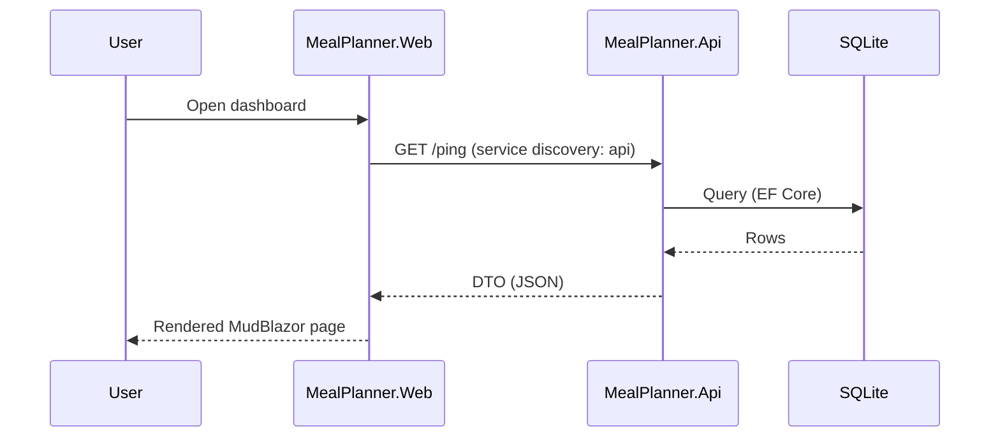
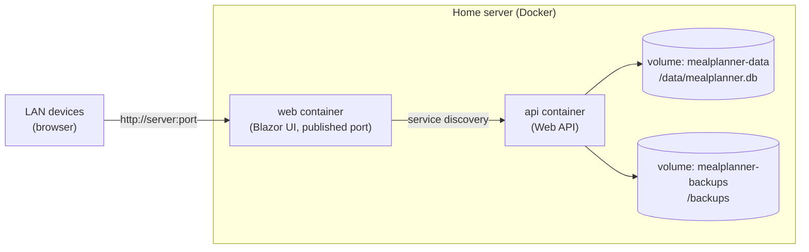
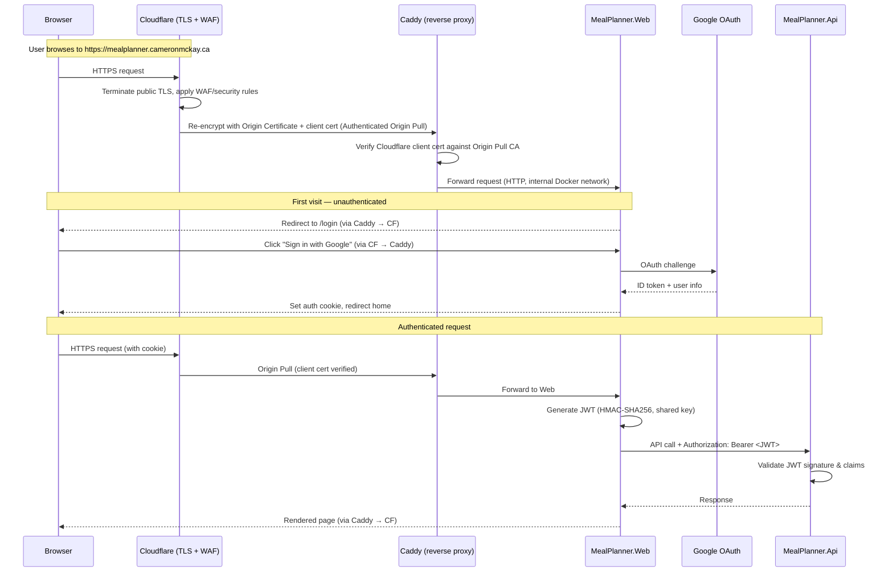

# MealPlanner — Solution Architecture

A local-network meal-planning web app for a two-person household. The system is built as a
layered .NET 10 solution orchestrated by .NET Aspire and deployed to Docker on the home network.

## Guiding rule of thumb

| Layer | Responsibility | Rule of thumb |
| --- | --- | --- |
| `MealPlanner.Domain` | Entities + calculation services (pure C#, no I/O) | *What the rules are* |
| `MealPlanner.Data` | EF Core `DbContext`, configs, migrations, CNF importer | *How it's stored* |
| `MealPlanner.Contracts` | DTOs shared over HTTP | *The shapes exchanged* |
| `MealPlanner.Api` | Web API endpoints, validation, composition root | *How it's exposed* |
| `MealPlanner.Web` | Blazor + MudBlazor UI | *How it's shown* |
| `MealPlanner.ServiceDefaults` | OpenTelemetry, health, resilience, discovery | *Cross-cutting concerns* |
| `MealPlanner.AppHost` | Aspire orchestration of Api + Web | *How it all runs together* |

Only **`MealPlanner.Api`** touches the SQLite database. The **`MealPlanner.Web`** UI reaches the
API exclusively through a typed `HttpClient` resolved by Aspire **service discovery** — it never
references EF Core or the database.

## Component & dependency diagram



## Runtime request flow (example: load the dashboard)



## Deployment topology (home network)

The repository ships a ready-to-run [docker-compose.yml](../docker-compose.yml) with a multi-stage
Dockerfile for each service ([Api](../src/MealPlanner.Api/Dockerfile),
[Web](../src/MealPlanner.Web/Dockerfile)). A single `docker compose up -d` starts two small
containers (Api + Web); the Web front-end reaches the Api by its `api` service name via Aspire
service-discovery configuration (`services__api__http__0`). The Api container mounts named volumes
so household data survives container rebuilds and updates. (`aspire publish` can also generate an
equivalent Compose project; the checked-in file is the maintained home-deploy artifact.)



## Data safety

- SQLite database file lives on a **named Docker volume** (`/data`), never the container layer.
- **WAL** journal mode is enabled on startup for safer concurrent read/write.
- A **pre-migration backup** of the database file is written to the backups volume before any
  pending EF Core migration is applied.
- Schema changes use EF Core **migrations** only (never `EnsureCreated`), with an
  **expand/contract** approach for destructive changes.

## Authentication & authorization

The app requires authentication for all user-facing pages and API endpoints.

### Flow



### Components

| Component | Mechanism | Details |
| --- | --- | --- |
| Cloudflare | TLS termination + WAF | Public TLS for visitors; security rules, DDoS protection |
| Caddy | Reverse proxy (port 443) | Origin Certificate for Cloudflare ↔ origin TLS; verifies Cloudflare client cert (Authenticated Origin Pulls) |
| Web login | Google OAuth 2.0 | ASP.NET Core cookie auth + Google external provider |
| Web session | Cookie | 1-hour sliding expiration |
| API auth | JWT Bearer | Validates issuer=`MealPlanner.Web`, audience=`MealPlanner.Api`, HMAC-SHA256 |
| Signing key | Shared secret | Passed to both services via Aspire parameters |
| Token lifetime | 1 hour | Sliding expiration; activity resets the window |

### JWT issuer and audience

The JWT contains two identity claims that the API validates on every request:

- **Issuer (`iss`: `MealPlanner.Web`)** — identifies who created the token. The API only accepts
  tokens issued by the Web service. This prevents tokens from untrusted sources being accepted.
- **Audience (`aud`: `MealPlanner.Api`)** — identifies who the token is intended for. The API only
  accepts tokens explicitly addressed to it. This prevents a token meant for a different service
  from being replayed against the API.

The Web stamps both claims when generating the token; the API rejects the token if either value
doesn't match. In a single-API deployment this is defense-in-depth — it becomes critical if a
second service is ever added that shares the same signing key but should not share access.

### Anonymous endpoints

- `/ping` — readiness probe (API)
- `/health`, `/alive` — health checks (both services)
- `/login` — login page (Web)
- `/auth/login`, `/auth/logout` — OAuth flow endpoints (Web)

### Role-based authorization

The system uses ASP.NET Core **policy-based authorization** with roles stored in the SQLite database.

#### Roles

| Role | Description | Access |
| --- | --- | --- |
| `User` | Default household member | All pages and endpoints |
| `Viewer` | Read-only guest | View dashboard, recipes, planner — no edits |
| `Admin` | Household admin | Everything + user/role management |
| `UserPending` | New user awaiting approval | No page access — sees pending-approval screen |

#### How it works

1. **User provisioning**: On first Google login, the Web project calls `POST /api/auth/ensure-user`.
   The API creates an `AppUser` record with the `UserPending` role (unless the email matches the
   bootstrap admin setting — see below).
2. **Role claims in cookie**: The returned roles are added as `ClaimTypes.Role` claims to the
   authentication cookie. Roles persist for the session lifetime (1 hour).
3. **JWT role claims**: `JwtAuthorizationHandler` copies all role claims from the cookie identity
   into every outbound JWT, so the API can enforce authorization without a database lookup.
4. **Policy enforcement**:
   - API endpoints use `.RequireAuthorization("User")` (or `"Admin"` for user management)
   - Blazor pages use `@attribute [Authorize(Policy = "User")]` (or `"Admin"`)
   - Policies are registered centrally via `AddMealPlannerAuthorization()` in `ServiceDefaults`
   - `UserPending` is deliberately excluded from all policies — pending users are redirected to
     `/pending-approval`

#### New user approval flow

1. New users log in via Google → receive `UserPending` role → see a "pending approval" page
2. Admin navigates to `/user-approvals` to review pending users
3. Admin can search, approve (one or all), or reject (one or all)
4. **Approve** replaces `UserPending` with `User` — takes effect on next login
5. **Reject** deletes the user record — they can re-register later

#### Admin bootstrap (seed command)

On fresh deployment, there are no admin users. The deployer uses a one-time anonymous endpoint to
register an admin email:

```bash
curl -X POST http://api:8080/api/admin/bootstrap \
  -H "Content-Type: application/json" \
  -d '{"email":"admin@example.com"}'
```

When that email's owner logs in via Google, they receive `Admin` + `User` roles instead of
`UserPending`. The endpoint returns `409 Conflict` if an admin already exists.

#### Data model

- `AppUser` — email, name, Google ID, timestamps
- `AppUserRole` — user-role assignment (many-to-many via role string)
- Both managed via EF Core with unique constraints on email, Google ID, and (userId, role)

#### Role change propagation

Role changes take effect on the user's **next login** (when the cookie is refreshed). This is
acceptable for a small user base; if needed, cookie invalidation can be added later.

#### Admin endpoints

- `POST /api/auth/ensure-user` — requires authentication only (no role)
- `POST /api/admin/bootstrap` — anonymous, only works when no admin exists
- `GET /api/users` — requires `Admin` role
- `GET /api/users/pending?search=` — requires `Admin` role
- `PUT /api/users/{id}/roles` — requires `Admin` role
- `POST /api/users/{id}/approve` — requires `Admin` role
- `POST /api/users/{id}/reject` — requires `Admin` role
- `POST /api/users/approve-all` — requires `Admin` role
- `POST /api/users/reject-all` — requires `Admin` role

> Keep this document updated as the architecture evolves; it is referenced from the README and the
> project-wide Copilot instructions.
