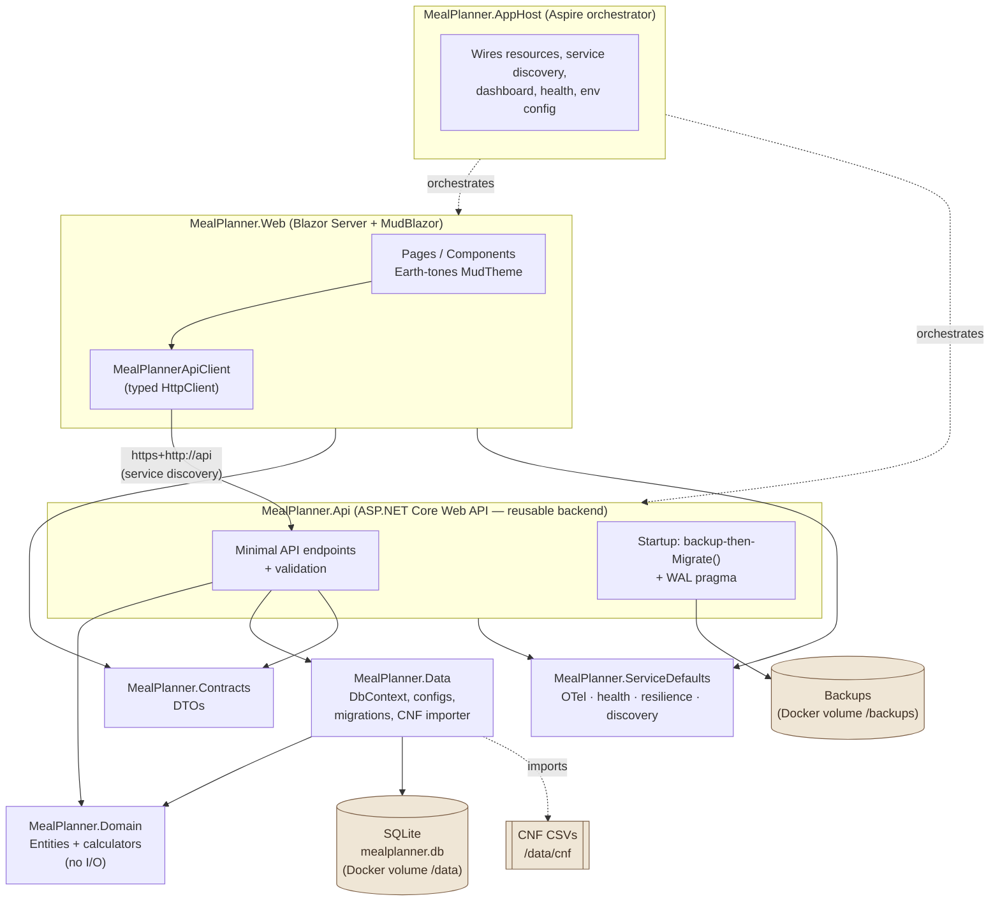
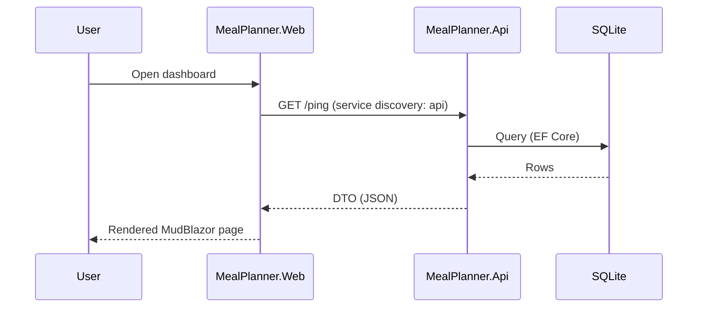
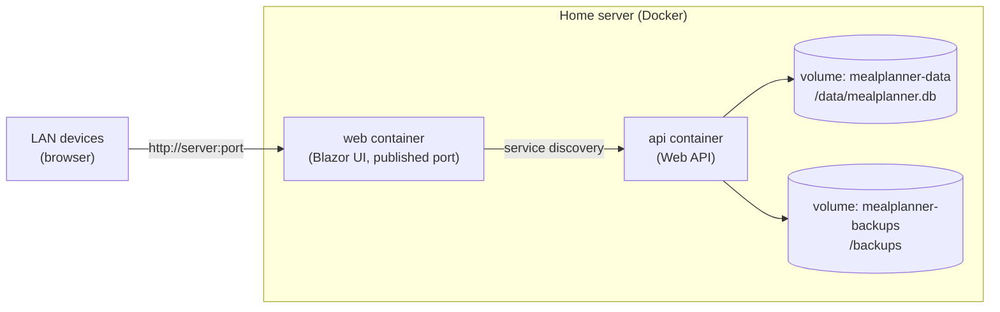
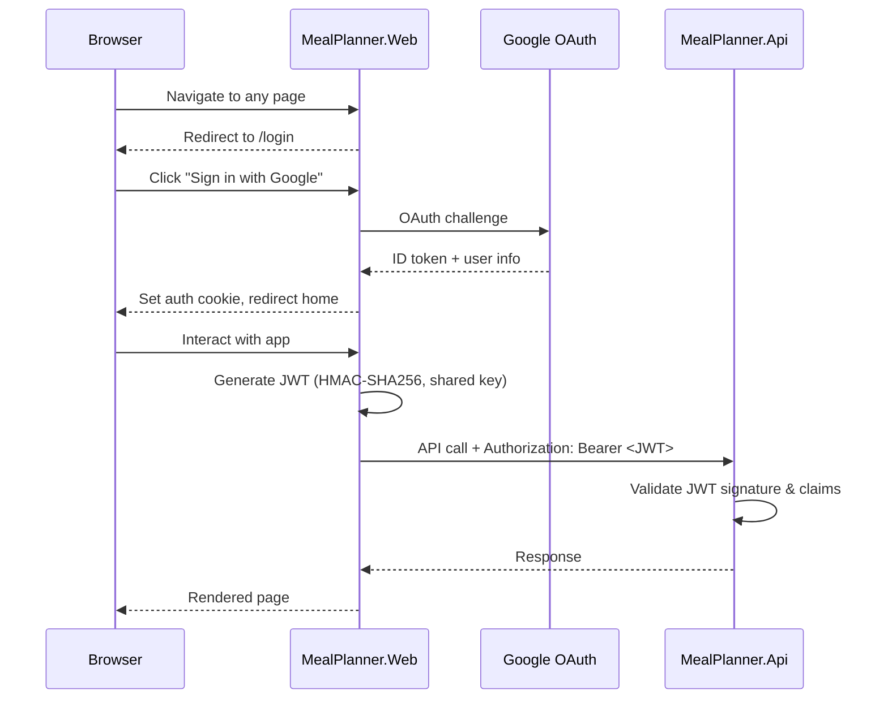

# MealPlanner — Solution Architecture

A local-network meal-planning web app for a two-person household. The system is built as a
layered .NET 10 solution orchestrated by .NET Aspire and deployed to Docker on the home network.

## Guiding rule of thumb

| Layer | Responsibility | Rule of thumb |
| --- | --- | --- |
| `MealPlanner.Domain` | Entities + calculation services (pure C#, no I/O) | *What the rules are* |
| `MealPlanner.Data` | EF Core `DbContext`, configs, migrations, CNF importer | *How it's stored* |
| `MealPlanner.Contracts` | DTOs shared over HTTP | *The shapes exchanged* |
| `MealPlanner.Api` | Web API endpoints, validation, composition root | *How it's exposed* |
| `MealPlanner.Web` | Blazor + MudBlazor UI | *How it's shown* |
| `MealPlanner.ServiceDefaults` | OpenTelemetry, health, resilience, discovery | *Cross-cutting concerns* |
| `MealPlanner.AppHost` | Aspire orchestration of Api + Web | *How it all runs together* |

Only **`MealPlanner.Api`** touches the SQLite database. The **`MealPlanner.Web`** UI reaches the
API exclusively through a typed `HttpClient` resolved by Aspire **service discovery** — it never
references EF Core or the database.

## Component & dependency diagram

## Runtime request flow (example: load the dashboard)

## Deployment topology (home network)

The repository ships a ready-to-run [docker-compose.yml](../docker-compose.yml) with a multi-stage
Dockerfile for each service ([Api](../src/MealPlanner.Api/Dockerfile),
[Web](../src/MealPlanner.Web/Dockerfile)). A single `docker compose up -d` starts two small
containers (Api + Web); the Web front-end reaches the Api by its `api` service name via Aspire
service-discovery configuration (`services__api__http__0`). The Api container mounts named volumes
so household data survives container rebuilds and updates. (`aspire publish` can also generate an
equivalent Compose project; the checked-in file is the maintained home-deploy artifact.)

## Data safety

- SQLite database file lives on a **named Docker volume** (`/data`), never the container layer.
- **WAL** journal mode is enabled on startup for safer concurrent read/write.
- A **pre-migration backup** of the database file is written to the backups volume before any
  pending EF Core migration is applied.
- Schema changes use EF Core **migrations** only (never `EnsureCreated`), with an
  **expand/contract** approach for destructive changes.

## Authentication & authorization

The app requires authentication for all user-facing pages and API endpoints.

### Flow

### Components

| Component | Mechanism | Details |
| --- | --- | --- |
| Web login | Google OAuth 2.0 | ASP.NET Core cookie auth + Google external provider |
| Web session | Cookie | 30-day sliding expiration |
| API auth | JWT Bearer | Validates issuer=`MealPlanner.Web`, audience=`MealPlanner.Api`, HMAC-SHA256 |
| Signing key | Shared secret | Passed to both services via Aspire parameters |
| Token lifetime | 1 hour | Sliding expiration; activity resets the window |

### JWT issuer and audience

The JWT contains two identity claims that the API validates on every request:

- **Issuer (`iss`: `MealPlanner.Web`)** — identifies who created the token. The API only accepts
  tokens issued by the Web service. This prevents tokens from untrusted sources being accepted.
- **Audience (`aud`: `MealPlanner.Api`)** — identifies who the token is intended for. The API only
  accepts tokens explicitly addressed to it. This prevents a token meant for a different service
  from being replayed against the API.

The Web stamps both claims when generating the token; the API rejects the token if either value
doesn't match. In a single-API deployment this is defense-in-depth — it becomes critical if a
second service is ever added that shares the same signing key but should not share access.

### Anonymous endpoints

- `/ping` — readiness probe (API)
- `/health`, `/alive` — health checks (both services)
- `/login` — login page (Web)
- `/auth/login`, `/auth/logout` — OAuth flow endpoints (Web)

> Keep this document updated as the architecture evolves; it is referenced from the README and the
> project-wide Copilot instructions.
